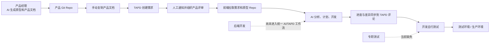

# 当前研发协作流程有什么问题

> 用于团队内部介绍。重点不是评价某个角色做得好不好，而是识别现有流程中依赖人工衔接、容易丢失上下文的环节。

## 一句话结论

我们已经在产品设计和前端开发阶段使用 AI 提效，但提效主要发生在个人环节；从产品规格、评审、前后端开发到测试发布，团队还缺少一条统一、可追踪、可续跑的交付链路。

## 当前流程

现状中的每个环节都可以工作，真正的问题出现在环节之间：信息需要人工搬运，版本关系不明确，不同角色进入需求时拿到的上下文也不完全一致。

## 问题一：需求存在多个版本，但没有明确的事实源

产品 Git Repo 中有完整文档和原型，TAPD 中又有一份手工复制的需求说明。需求调整后，团队很难快速回答：

- Git Repo 和 TAPD 哪一份是最新的？
- 当前开发依据的是哪个 commit？
- 评审通过的是哪个版本？
- 原型变了以后，哪些前端、后端和测试内容需要重新确认？

结果是开发人员仍需要反复向产品确认，或者基于不同版本开始实现。

## 问题二：AI 提效停留在个人环节，交接仍靠手工

产品经理可以用 AI 生成原型和文档，前端也可以用 AI 分析并开发，但两者之间仍然需要：

- 手动复制产品文档到 TAPD。
- 手动整理原型地址和版本。
- 手动通知参与评审的成员。
- 开发重新让 AI 理解一次需求、原型和历史评论。

AI 节省下来的时间，有一部分又消耗在信息搬运和重复理解上。

## 问题三：工作流偏向前端，团队角色覆盖不完整

当前 TAPD Skill 主要围绕前端的习惯设计：创建分支、理解需求、制定计划、同步差异、完成开发。

但一个需求还包括：

- 后端接口、数据结构、权限和兼容性处理。
- 前后端依赖和联调顺序。
- 验收用例、测试环境验证和生产冒烟。
- 发布风险、回滚方案和最终证据。

后端和质量环节没有进入同一套上下文后，团队整体效率仍受最慢的交接环节限制。

## 问题四：产品评审更像一次会议，不是一个可验证的 Gate

当前流程可以组织产品评审，但评审结束后通常缺少结构化结果：

- 哪些问题已确认？
- 哪些问题仍待处理，由谁负责？
- 哪些验收点已经达成一致？
- 评审通过对应哪个产品规格版本？
- 评审之后发生的需求变化是否需要重新评审？

当评审结论没有与精确版本绑定时，会议结束不等于开发已经获得稳定输入。

## 问题五：没有专职测试，质量责任容易变成“大家自己测”

开发自行测试能够覆盖主流程，但容易出现三个缺口：

- 测试用例往往在开发完成后才临时整理。
- 产品验收点与实际测试项缺少映射。
- 测试环境、生产环境的验证结果和证据没有统一沉淀。

没有专职测试并不是问题本身；真正的问题是没有明确的质量负责人、统一 Case 和发布前 Gate。

## 问题六：进度同步有了，但交付证据仍然分散

目前可以把进度和产品差异同步到 TAPD 评论，但代码、测试和发布之间还没有完整关联：

- 一个验收点对应哪些开发任务？
- 哪个分支或提交实现了它？
- 哪条 Case 验证了它？
- 测试和生产分别在哪个版本验证通过？

缺少这条证据链时，需求收尾依然依赖参与者记忆。

## 问题七：流程与 TAPD 概念耦合，未来迁移成本高

如果核心工作流直接使用 Story、TAPD 字段和 TAPD URL 表达，未来迁移飞书时容易重做一遍流程。

团队真正需要固化的是通用交付语义：

- Requirement：要解决什么问题。
- Task：各角色交付什么。
- TestCase：如何证明完成。
- Defect：验证失败如何闭环。
- Evidence：发布是否可信。

TAPD 或飞书应该是承载这些对象的 Provider，而不是流程本身。

## 这些问题带来的团队成本

| 流程问题 | 直接成本 | 团队影响 |
|---|---|---|
| 文档重复复制 | 重复操作、同步遗漏 | 产品发布需求耗时 |
| 版本不明确 | 反复确认、错误实现 | 返工和评审失效 |
| 角色上下文不一致 | 重复理解、等待答复 | 前后端联调延迟 |
| 测试后置 | 覆盖不完整 | 缺陷更晚暴露 |
| 证据分散 | 收尾靠人工核对 | 发布风险不可见 |
| 平台耦合 | 迁移时重做流程 | 长期维护成本上升 |

## 我们真正需要优化的不是单个动作

目标不是再增加一个 AI 命令，而是让团队从同一个已评审规格版本出发，沿着统一协议完成开发、验证和发布，并且任何成员都能随时回答：

1. 当前需求依据哪个规格版本？
2. 产品评审确认了什么？
3. 前端、后端和质量分别做到哪里？
4. 哪些验收点已经有证据，哪些仍有风险？
5. 当前是否具备发布条件？

这也是后续 Flow 团队工作流要解决的核心问题。
