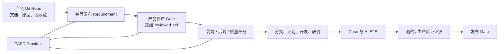

# 我的工具解决了什么问题

> 用于团队内部介绍。建议先讲“它不是一个 TAPD 命令集合”，再讲当前已经打通的链路和后续扩展方向。

## 30 秒介绍

Flow 是一套面向团队的 AI 研发交付工作流。

它以产品 Git Repo 作为完整规格事实源，以 TAPD 作为第一个协作 Provider，把产品规格、产品评审、开发任务、测试用例和发布证据串联起来。

它要解决的不是“让某个人写代码更快”，而是减少团队在复制文档、重复理解、确认版本、等待联调和人工收尾上的时间。

## 产品定位

```text
以前：TAPD Skill = 前端个人使用的 TAPD + AI 开发助手

现在：Flow = 团队研发交付协议 + AI 工作流编排 + TAPD Provider
```

TAPD 是当前落地平台，但不是产品边界。核心流程使用 Requirement、Task、Defect、TestCase 和 Evidence 等通用概念，未来可以增加飞书 Provider，而不需要重新设计团队流程。

## 它如何连接团队链路



当前版本优先完成第一段纵向链路，同时兼容已有的开发工作流；后端、自动化测试和发布 Gate 按路线逐步接入。

## 内部试用版当前提供的能力

当前定位是团队内部 Beta：本地初始化与规格校验已有固定 CLI 和自动测试；TAPD MCP 必需能力与只读连通性已经验证。首次真实 Requirement 创建、更新和评审写回将在试用需求中由演示者陪跑，同时收集产品同事反馈。

### 1. 产品文档不再需要手工完整复制

产品仓库提交 `.flow/spec.json` 后，产品经理可以直接说：

```text
/tapd 从当前产品仓库发布需求
```

工具会读取指定 commit 的产品文档和原型，生成 TAPD Requirement 摘要，并回填远端链接。产品 Git Repo 保存完整规格，TAPD 保存适合协作和执行的摘要。

### 2. 重复执行不会反复创建需求

每个规格都有稳定 `spec_id`，发布时会检查已有 Story 的稳定标题和受管标记：

- 没有匹配：创建新 Requirement。
- 唯一匹配：恢复映射或更新原 Requirement。
- 多条匹配：停止并要求人工选择。
- 内容和状态都没有变化：幂等跳过。

即使创建后本地回填中断，重新执行也不会直接创建第二条需求。

### 3. 开发能知道自己使用的是哪个已评审版本

正式规格绑定精确 Git commit，而不是模糊的分支名或“当前最新版”。

只有同时满足以下条件，工具才把规格视为正式开发输入：

- 产品评审状态为 `approved`。
- `source.ref` 与 `reviewed_ref` 相同。
- TAPD Requirement 映射可以回读。
- 产品文档和原型路径有效。

否则只能进行澄清、技术预研或只读计划，并明确提示风险。

### 4. 产品评审从一次会议变成明确 Gate

产品经理可以说：

```text
/tapd 准备产品评审
```

工具会生成评审输入包，包括：

- 目标、范围和非目标。
- 产品文档与原型版本。
- `AC-*` 验收点。
- 文档与原型的高影响差异。
- 权限、状态、异常和兼容性问题。
- 前端、后端和质量任务草案。
- 接口、数据、环境和发布依赖。
- 需要团队共同决定的问题。

AI 可以整理材料，但不能自动宣布评审通过。只有人明确确认后，才会记录评审状态和 `reviewed_ref`。

### 5. 评审后的需求变化不会被静默使用

当产品规格发生变化，`source.ref` 与已评审的 `reviewed_ref` 会不同。工具会：

1. 标记“评审后规格变化”。
2. 对比两个版本。
3. 判断变化影响验收、接口、数据、范围还是发布风险。
4. 只对受影响范围发起增量评审。

这可以减少“产品文档已经改了，但开发和测试仍按旧口径执行”的情况。

### 6. 已有前端开发流程继续可用，并获得稳定规格输入

现有能力没有被推倒重做，仍然支持：

- TAPD Story、Task、Bug intake。
- 创建与需求绑定的开发分支。
- 后续会话恢复上下文。
- AI 读取产品文档、原型和 tasks 后制定计划。
- 编码前发现会导致返工的高影响差异。
- 经确认后把差异、进度和联调说明同步到 TAPD 评论。
- 拆任务、估时、日报、今日待办和团队风险盘点。

不同之处是：当存在通过评审的 Flow Manifest 时，开发必须以精确 `reviewed_ref` 为规格事实源。

## 配置如何做到尽量开箱即用

团队配置与个人配置分离：

| 配置 | 谁维护 | 是否提交 | 内容 |
|---|---|---|---|
| `.flow/spec.json` | 产品负责人 | 是 | 规格、原型、验收点和版本映射 |
| `.tapd/team.json` | 团队维护者 | 是 | workspace、分支、角色权限和写回策略 |
| `.tapd/config.json` | 每位成员 | 否 | 个人昵称、profile 和少量覆盖项 |
| TAPD MCP token | 每位成员 | 否 | 个人 TAPD 权限 |

团队规则只需要维护一次。普通成员不需要理解 Provider 字段或每次填写 workspace、分支前缀、权限范围和估时参数。

推荐的开箱方式：

1. 团队在产品仓库和代码仓库提交共享模板。
2. 成员首次使用时配置个人 token、昵称和角色。
3. 后续直接使用“发布需求、准备评审、开始开发、继续开发、收尾”等自然语言入口。

## 对不同角色的价值

| 角色 | 直接收益 |
|---|---|
| 产品经理 | 减少复制需求；评审结论与规格版本绑定；变更影响更清楚 |
| 前端开发 | 自动恢复需求上下文；减少版本确认；提前发现原型差异 |
| 后端开发 | 后续进入同一规格、任务和接口依赖链路，减少被动等待 |
| 质量负责人 | 从验收点生成 Case；明确测试范围和未覆盖项 |
| 研发负责人 | 查看团队 WIP、阻塞和交付风险，而不是只看任务数量 |

## 当前边界：哪些已经可用，哪些仍在路线图中

### 当前可用

- 产品 Git Repo 的规格 Manifest。
- TAPD Requirement 幂等发布和更新。
- 产品评审包、人工 Gate、版本冻结和增量复审。
- 前端现有 TAPD 开发工作流。
- 通用 Provider Contract 和 TAPD Adapter 边界。

### 后续扩展

- M2：后端、质量任务和前后端接口依赖进入统一编排。
- M3：`AC-*` 映射测试 Case，接入 AI E2E，在测试和生产环境留存证据。
- M4：发布 Gate、生产冒烟、发布说明和回滚摘要。
- M5：增加飞书 Provider，并支持 TAPD 与飞书的迁移过渡。

## 建议团队如何试点

先选择一个中等规模、前后端边界比较清楚的新需求，不立即要求全团队改变所有习惯。

试点只验证四件事：

1. 产品经理是否减少了复制和同步工作。
2. 评审后开发是否能明确拿到唯一规格版本。
3. 产品文档和原型差异是否更早暴露。
4. 团队是否减少了重复澄清和返工。

建议观察：

- 产品需求发布耗时。
- 评审后需求再次澄清次数。
- 因规格或原型不一致导致的返工次数。
- 从评审通过到可提测的周期。
- 未映射到验收点的开发或测试项数量。

这些指标用于发现流程瓶颈，不用于个人绩效排名。

## 明天介绍时可以这样收尾

Flow 当前不是要一次性替换团队所有工具，而是先建立一条共同遵守的交付协议：

> 产品规格有唯一版本，评审有明确结论，开发和测试使用同一份验收口径，最后能够用证据判断是否可以发布。

第一阶段先把“产品 Repo → TAPD Requirement → 产品评审 → 前端开发”跑顺，再逐步把后端、AI E2E、发布验证和飞书接进来。
